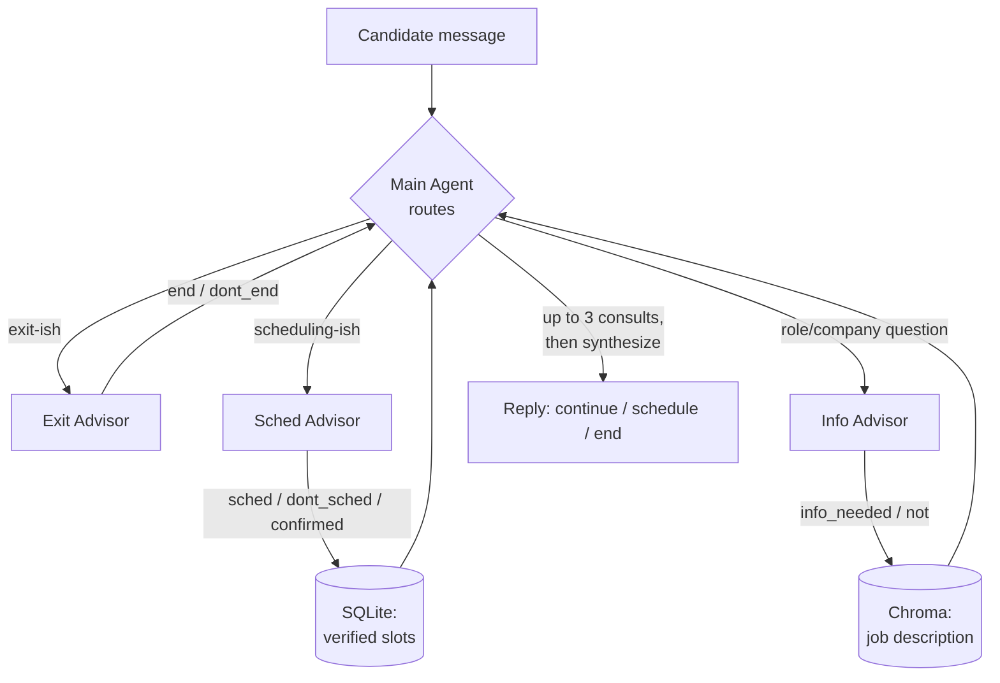

# GenAI Recruiter Bot

A multi-agent SMS-style recruiting chatbot for a Python Developer position. A **Main Agent**
orchestrates three specialist advisors — **Exit** (should the conversation end?), **Sched**
(should we offer/confirm an interview time?), **Info** (does the candidate need role/company
info?) — and is the only one that ever talks to the candidate. Built for a GenAI course final
project; full behavioral spec in [`docs/PROJECT_SPECIFICATION.md`](docs/PROJECT_SPECIFICATION.md).

## Architecture

Every turn: the Main Agent reads the complete chat history and decides which advisor(s) to
consult (up to 3 per turn), then synthesizes a single reply carrying exactly one action label —
`continue`, `schedule`, or `end`. Advisors never emit user-facing text themselves; scheduling
slots are always verified against the live DB in the same turn they're offered (never guessed).



- **Main Agent** — `app/graph.py` (turn loop, guard R-1, synthesis) + `app/modules/main_agent/`
  (LLM routing decision)
- **Exit Advisor** — `app/modules/exit_advisor/` — disinterest/opt-out detection
- **Sched Advisor** — `app/modules/sched_advisor/` — relative-date resolution
  (`date_resolver.py`), DB-backed slot lookup/booking (`tools.py`, `repository.py`)
- **Info Advisor** — `app/modules/info_advisor/` — RAG over the job description (Chroma)
- Every LLM decision is parsed through a Pydantic schema (`app/schemas.py`), never free text —
  parse failure retries once, then falls back deterministically (`app/structured_output.py`)

This is a **plain-Python control-flow implementation** of the spec's turn-flowchart behavior,
not the literal `langgraph` `StateGraph` API the tech stack section mandates — a deliberate,
documented scope decision (see `CLAUDE.md`).

## Project structure

```text
app/
├── main.py                        # terminal chat REPL
├── graph.py                       # turn loop: routing, guard, synthesis, trace
├── state.py                       # ConversationState
├── schemas.py                     # Pydantic AdvisorOutput contracts
├── structured_output.py           # retry-once-then-fallback wrapper
├── llm_client.py                  # shared OpenAI client + disk-cached structured calls
├── config.py                      # typed settings (.env)
└── modules/
    ├── main_agent/                # routing prompt + decision
    ├── exit_advisor/
    ├── sched_advisor/             # date_resolver.py, tools.py, repository.py
    ├── info_advisor/              # retriever.py (Chroma RAG)
    ├── embedding/                 # build_index.py — job-description vector index
    ├── scheduling/                # db_setup.py — SQLite seed
    └── fine_tuning/               # placeholder — not started (Epic E3)
streamlit_app/streamlit_main.py    # registration form -> chat UI -> dev trace panel
tests/                             # pytest suite (mocked; zero real API calls by default)
docs/                              # spec, task plan, devlog, eval notebook + confusion matrix
data/                              # raw dataset/PDF/SQL seed + rebuildable DB/vector index
```

## Setup

```bash
python -m venv .venv && source .venv/bin/activate   # Windows: .venv\Scripts\activate
pip install -r requirements.txt
cp .env.example .env                                 # fill in OPENAI_API_KEY
python -m app.modules.scheduling.db_setup             # build data/tech.db (rebuildable)
python -m app.modules.embedding.build_index           # build the Chroma vector index
python -m app.main --check-config                     # sanity check
```

`.env` also carries `DEMO_NOW_OVERRIDE=2024-04-15T10:00:00Z` — the seeded DB's slots live in
2024, so date resolution needs "now" pinned there for a working demo (never edit
`.env.example` with a real key; only `.env` is git-ignored).

## Usage

**Terminal chat:**

```bash
python -m app.main
```

```
Recruiter bot ready. Type 'quit' to exit.
You: I've been using Python professionally for five years, mostly for data analysis.
Bot [continue]: ...
You: Can we schedule an interview for tomorrow?
Bot [schedule]: I can offer these interview times: 2024-04-16 at 10:00:00; ... Which works best for you?
You: The first one
Bot [end]: Great, you're all set! Your interview is confirmed for 2024-04-16 at 10:00:00.
```

**Streamlit UI** (registration form → SMS-style chat → toggleable dev trace panel showing every
advisor consulted, its decision/reason, and retrieved slots/chunks):

```bash
streamlit run streamlit_app/streamlit_main.py
```

## Evaluation

`tests/eval_replay.py` replays the labeled dataset conversations through the real graph/API and
reports accuracy, per-class precision/recall/F1, and a confusion matrix; `tests/test_evals.ipynb`
is the formal notebook deliverable (spec §9) with the full error analysis.

- **Isolated per-turn replay** (`--mode isolated`, the notebook's baseline methodology): **52.3%**
  (23/44). Confusion matrix: [`docs/eval_confusion_matrix.png`](docs/eval_confusion_matrix.png).
- **Sequential full-conversation replay** (`--mode sequential`, default — one real conversation
  state walked turn-by-turn, matching spec §9's "feed the system the history up to that point"
  literally): **59.1% raw (26/44), 72.2% adjusted (26/36)** once conversations where our bot's
  own generated offer necessarily diverges from the dataset's scripted one are excluded (tagged
  automatically — see `_is_divergence_artifact` in `tests/eval_replay.py`).

Neither run meets the spec's 85% target; the honest gap analysis (ranked failure patterns, what
would actually close the gap) is in the notebook and `docs/DEVLOG.md`'s CORE-REV entries — the
largest remaining pattern turned out to have genuinely inconsistent ground truth in the dataset
itself (identical candidate messages carry opposite gold labels in different conversations), not
a fixable routing bug.

```bash
python -m tests.eval_replay              # sequential (default)
python -m tests.eval_replay --mode both  # both, for comparison
```

## Live deployment

Not yet deployed — the Streamlit UI is built and verified locally (`streamlit run
streamlit_app/streamlit_main.py`), but connecting it to Streamlit Community Cloud requires an
account and a GitHub push that are outside this repo's own scope.

## Testing & lint

```bash
pytest              # full suite, zero real API calls (105+ tests, all mocked)
pytest -m real_api  # scenario tests that DO call the real API/DB (see tests/test_scenarios.py)
ruff check .
```

## Current status

Epics E0–E2, E4, E6 are done; E5 (evaluation) is done as an honest-gap-analysis outcome; E3
(fine-tuning) is out of scope for now; E7 (this document) is in progress. See
[`docs/PROJECT_TASKS.md`](docs/PROJECT_TASKS.md) §0 for the live per-task status table and
[`docs/DEVLOG.md`](docs/DEVLOG.md) for the full session-by-session history.
